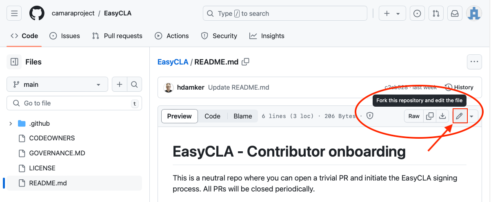
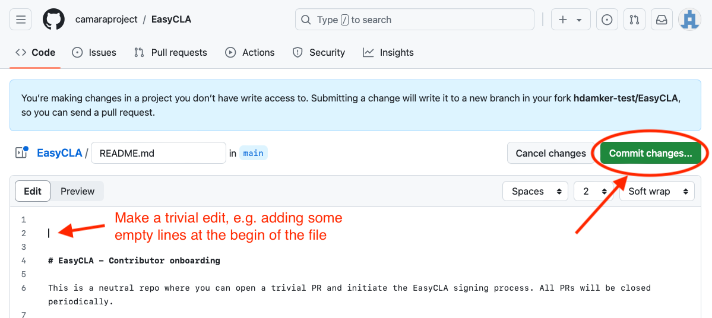
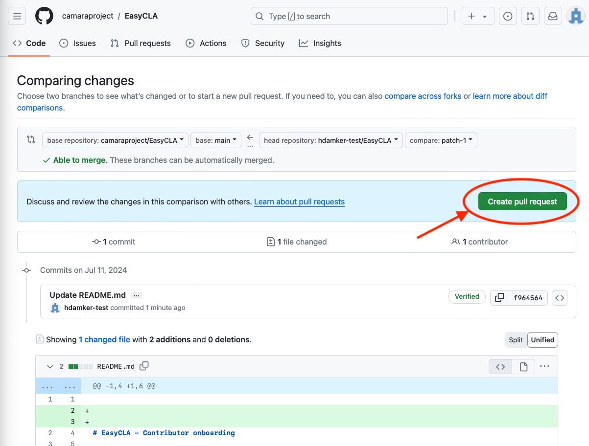
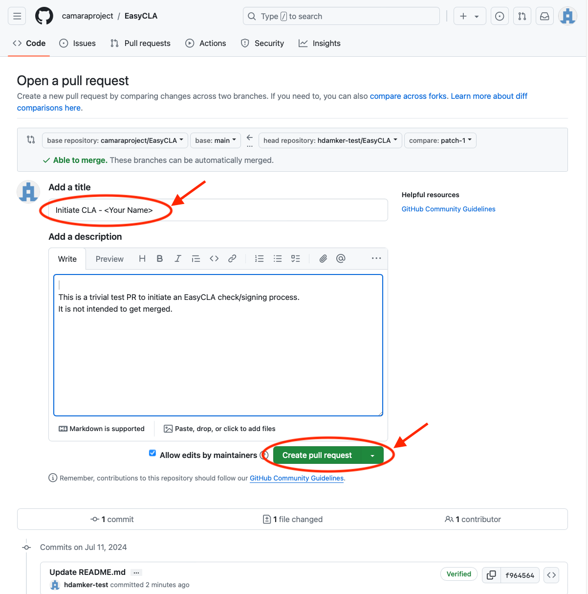
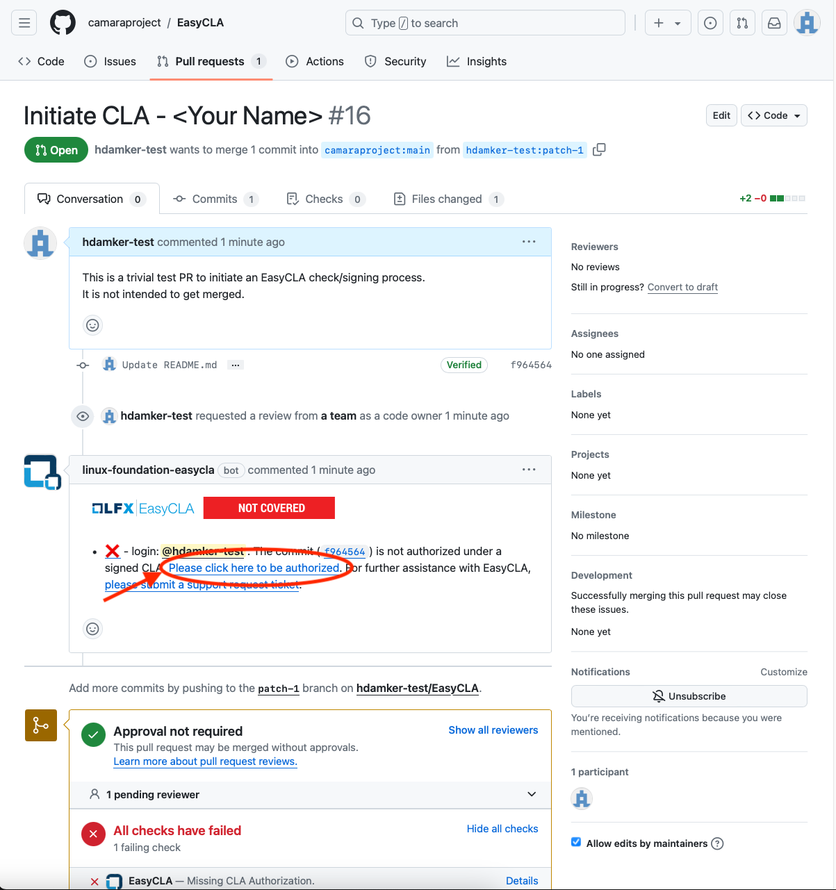
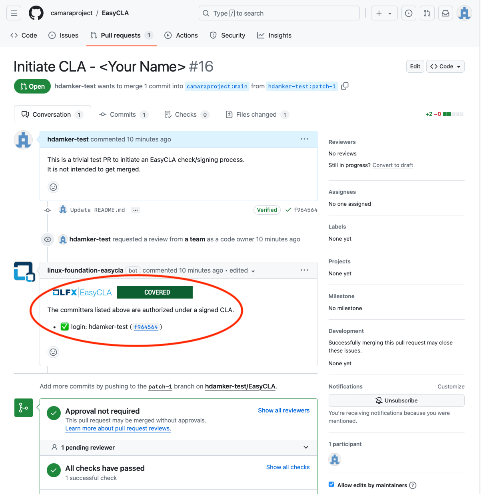

# EasyCLA - Contributor onboarding

This is a neutral repo where you can open a trivial PR and initiate the EasyCLA signing process. All PRs will be closed periodically.

NOTE: For Sub Project repositories the EasyCLA check will be activated soon - please use the opportunity to sign your CLA in advance by following the below instructions.

## CAMARA Community License Agreement and EasyCLA

The [ProjectCharter](https://github.com/camaraproject/Governance/blob/main/ProjectCharter.md) of CAMARA requires that every Contributor to CAMARA and its Sub Projects has to sign a Community License Agreement. You only need to do this one time. For this purpose the repositories of CAMARA are managed by [EasyCLA](https://docs.linuxfoundation.org/lfx/easycla/v2-current/getting-started) including this one.

A Contributor is someone who contributes either on behalf of a company, or individually on their own behalf.
* If contributing on behalf of their company: The contributor will identify the company on whose behalf they are contributing, so that they can either be authorized under a signed CCLA or else start the CCLA signing process.
* If contributing on their own behalf: the Contributor will ​sign an Individual Contributor License Agreement (ICLA).

**Important**: You should not submit a contribution under an ICLA if that contribution is done on behalf of your company. Instead, you should contribute under a Corporate CLA signed by your company. If you are uncertain whether you should be contributing under a CCLA or an ICLA, you should consult your employer's legal department to discuss.

## How to initiate the CLA signing process

To initiate the signature process please open a trivial PR against this repository. The EasyCLA bot will block the merge if we still need a membership agreement from you and provide a link to start the signing process.

The process is explained in detail in the [EasyCLA documentation](https://docs.linuxfoundation.org/lfx/easycla/v2-current/getting-started), specifically here for [Contributors](https://docs.linuxfoundation.org/lfx/easycla/v2-current/contributors).

If your company is in the system but you don't know who your CLA manager is, you can email adm@lists.camaraproject.org.

If you run into issues, you can [open a ticket in JIRA](https://jira.linuxfoundation.org/plugins/servlet/theme/portal/4/create/143).

## How to open a PR in a few easy steps

Note: The following steps assume that you are contributing on behalf of your company, signing a Company CLA.

### Step 0 - Setup a GitHub Account and Login

You need to be signed into GitHub using an account registered to your organization email address.

* If you have not done this previously you can [register a new account here](https://github.com/signup)
* Once you have an account [login to GitHub](https://github.com/login)

### Step 1 - Initiate a fork and edit to this repo

In order to trigger the signing process you need to fork this repo and submit a pull request (PR). This sounds like a hard process but luckily the GitHub web interface handles most of the steps for you.

* Open the following URL: https://github.com/camaraproject/EasyCLA/blob/main/README.md
* Click on the pencil icon, this will fork the repo into your own GitHub account and allow you to make a change to be submitted back.

### Step 2 - Make a trivial change and Commit

Once you enter the edit screen just make a nothing change to the file, e.g. adding a few empty lines to the end of the file. It is important to note any information you type here will be public so avoid adding any information.

* Add empty lines to the file, e.g. at the beginning
* Click on "Commit changes ..."
* Click on "Sign off and propose changes" in the next dialog

### Step 3 - Create Pull Request (PR)

Now you have a staged commit in your forked repo you can submit a pull request (PR) back to the CAMARA repository

* Click on "Create pull request"
* Update the name of your pull request to "Initiate CLA - " - Replace Your name with your actual name ;)
* Click on "Create Pull Request"

### Step 4 - Find your PR and trigger signing

Now you have opened a PR it will cause the EasyCLA to check on your signing status and enable you to start the signing process.

* Open pull [requests for this repo](https://github.com/hdamker/EasyCLA/pulls)
* Find your open pull request in the list and select it
* Check on the status of the EasyCLA add-on, if you are not covered you will need to start the signing process by selecting "click here to be authorized"

### Step 5 - Complete the CLA Signing Process

At this stage you have started the CLA signing process and can follow the documentation provided by the Linux Foundation on the EasyCLA process.

* Follow the steps outlined in the [Linux Foundation Documentation](https://docs.linuxfoundation.org/lfx/easycla/v2-current/contributors/corporate-contributor#github)
* If you are the first to sign up for your organization you will need to get your CLA Manager in your organization to sign first and [setup your organization for signing the CLA](https://docs.linuxfoundation.org/lfx/easycla/v2-current/contributors/corporate-contributor#if-company-has-not-signed)
* If your company is in the system but you don't know who your CLA manager is, you can email adm@lists.camaraproject.org.

### Step 6 - Confirm authorization

Once you have completed the process of signing the CLA and have been added to your organization by your CLA Manager you need to confirm your authorization by doing the signing process one last time.

* Open pull [requests for this repo](https://github.com/hdamker/EasyCLA/pulls)
* Find your open pull request in the list and select it
* Check on the status of the EasyCLA add-on, if you are not covered you will need to start the signing process by selecting "click here to be authorized"
* After completing this process you should see you pull request has been authorized

